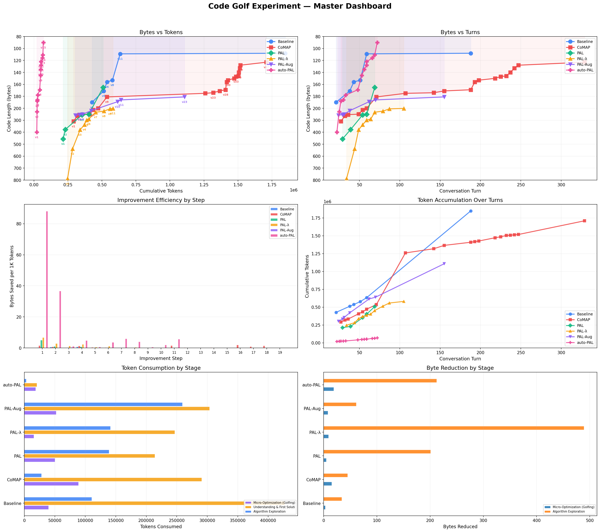
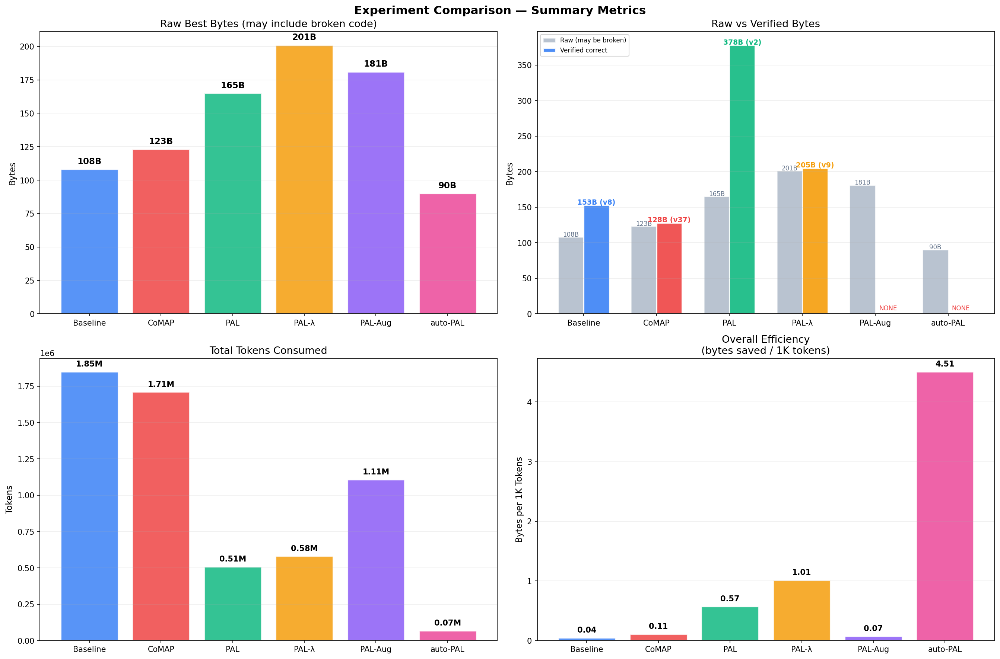
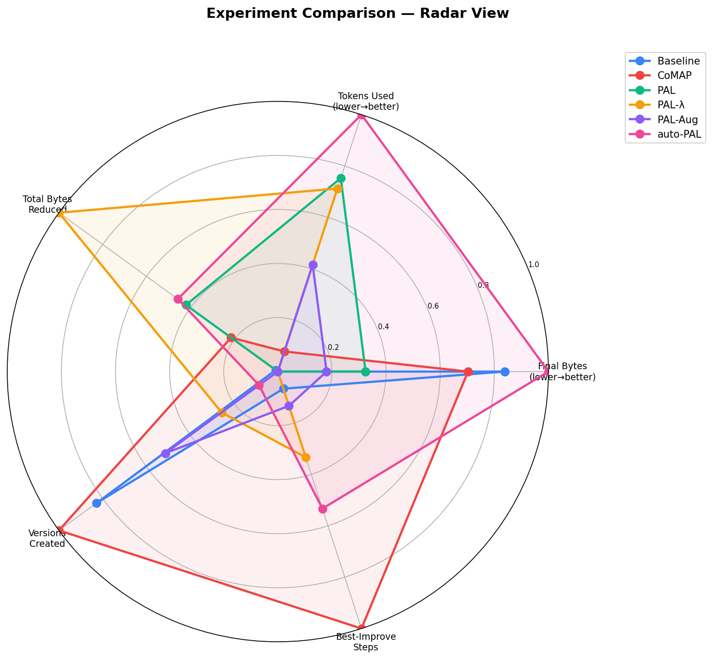
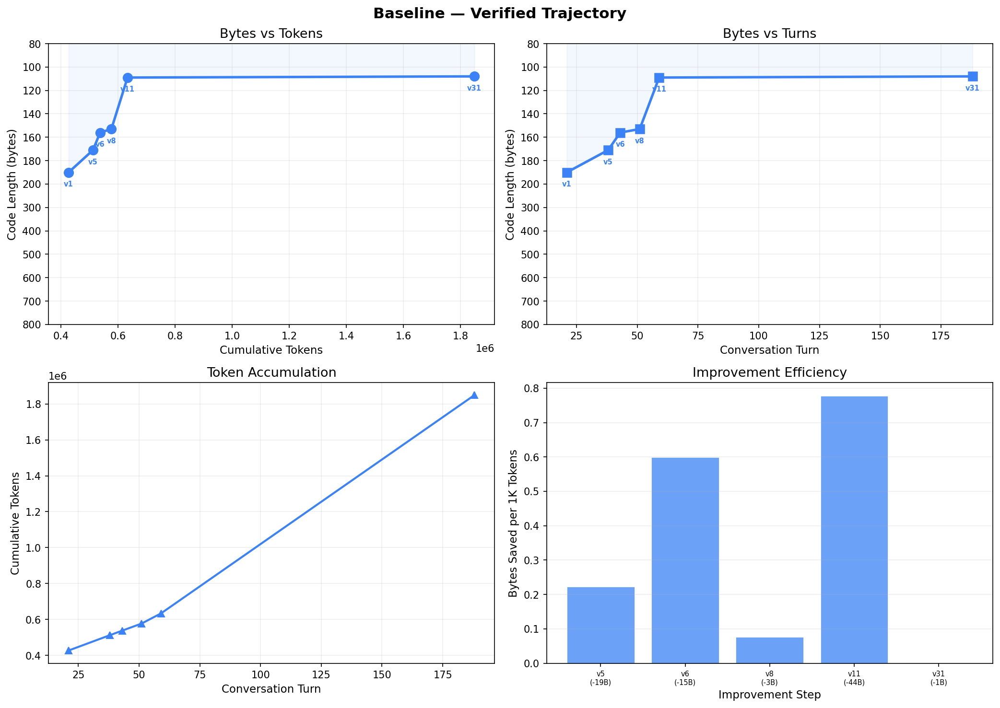
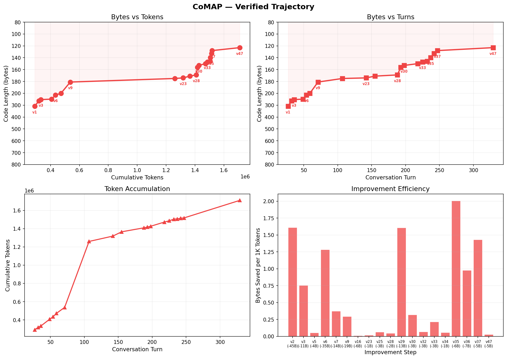
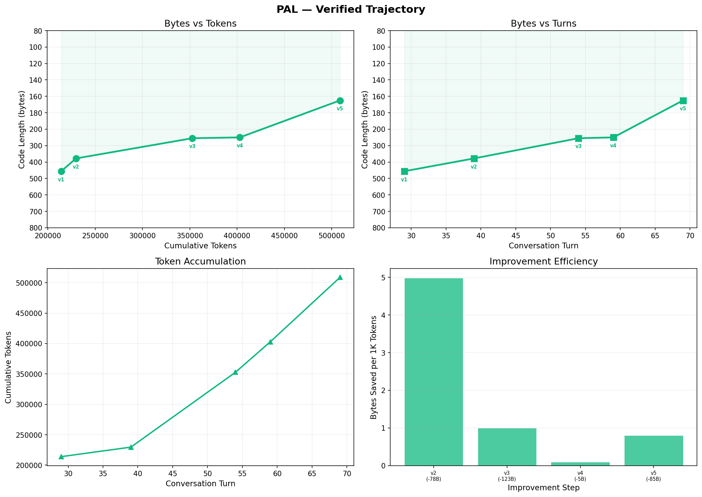
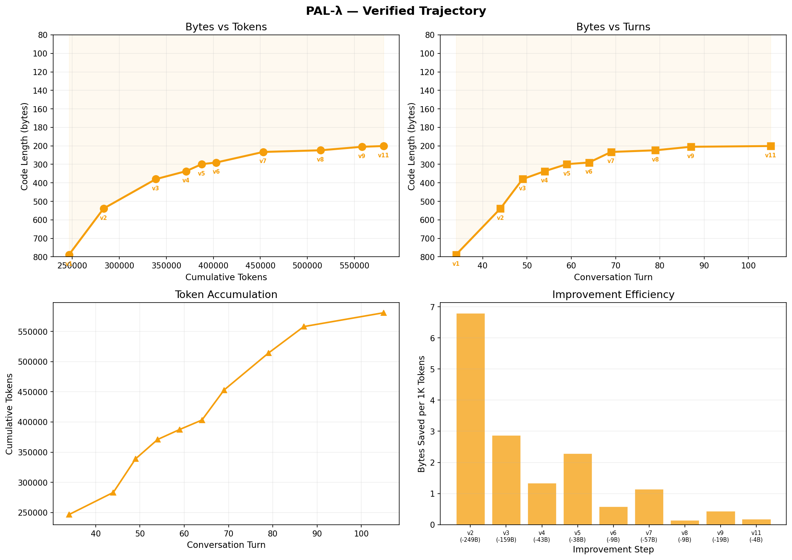
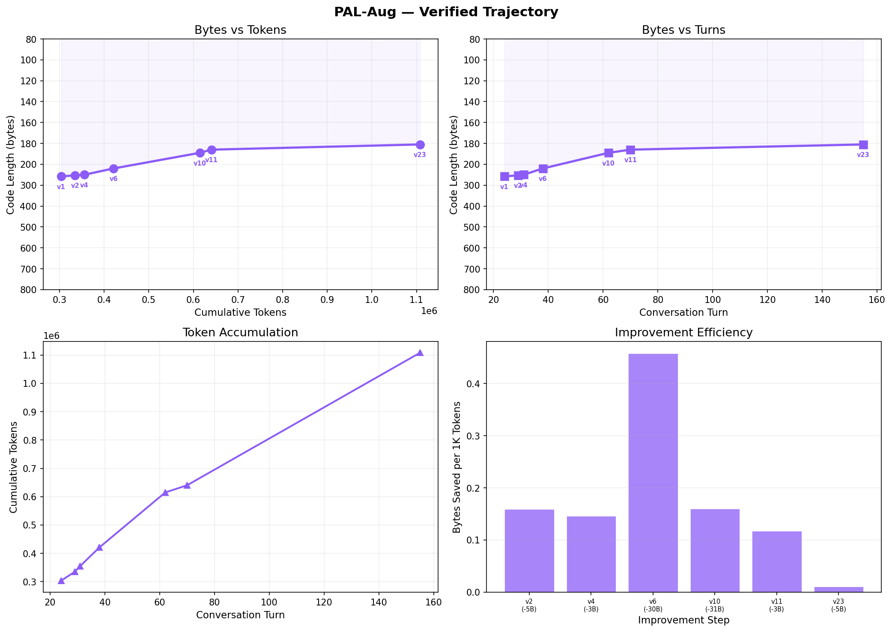
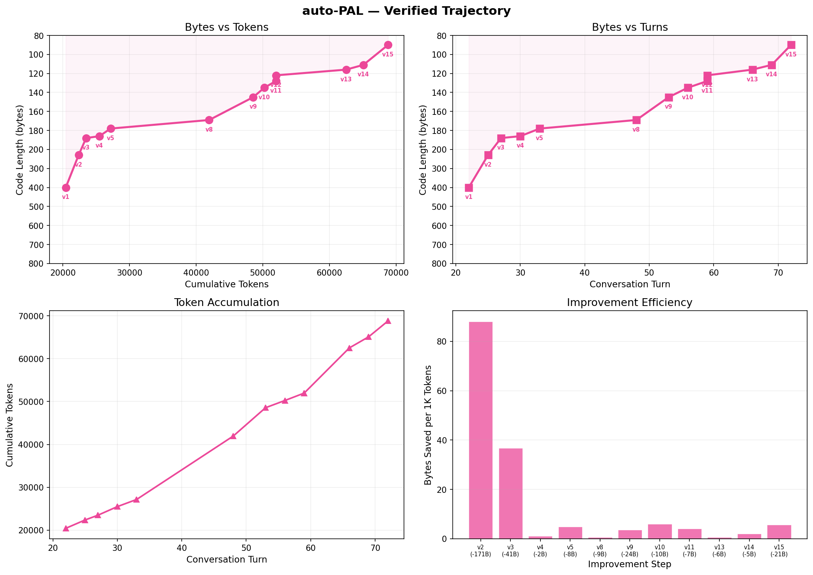

# Code Golf — Experiment Results

Google Code Golf 2025 Task 004，使用 deepseek-v4-pro 测试 6 种不同的 prompt / agent 策略。

## 📊 Final Results

### Master Dashboard

### Comparison Summary

### Radar Comparison

### Per-Method Trajectories

| Method | Trajectory |
|--------|-----------|
| Baseline |  |
| CoMAP |  |
| PAL |  |
| PAL-λ |  |
| PAL-Aug |  |
| auto-PAL |  |

### Interactive Dashboard

Open [`final-result/dashboard.html`](final-result/dashboard.html) in your browser for an interactive Chart.js dashboard.

## 🔬 Six Methods

| Method | Prompt Size | Strategy |
|--------|------------|----------|
| **Baseline** | 11 KB | Standard code-golf workflow guidance |
| **CoMAP** | 11 KB | Same prompt as Baseline, different agent scaffolding |
| **PAL** | 1.9 KB | PAL structured reasoning: decompose → code → verify |
| **PAL-λ** | 2.9 KB | PAL + Lambda calculus: functional decomposition, compositional reasoning |
| **PAL-Aug** | 1.9 KB | Same prompt as PAL, augmented variant |
| **auto-PAL** | 908 B | Minimal prompt, task description only, no meta-guidance |
