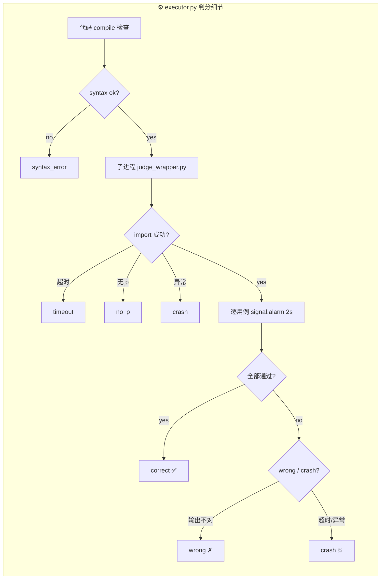
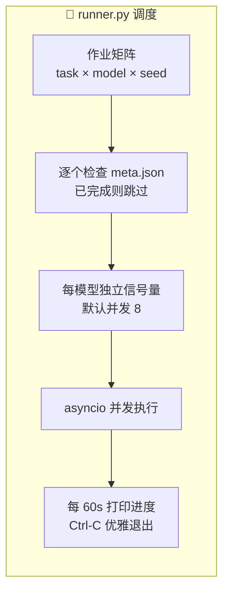
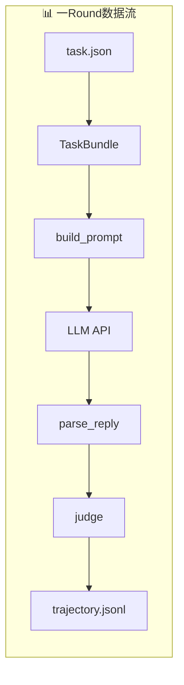

# 架构概览

```mermaid
flowchart TB
    subgraph 输入["📥 输入"]
        T[400 道题目<br/>task*.json<br/>train + test + arc-gen]
        G[生成器 gen.py<br/>仅 task001-010]
        C[config.yaml<br/>模型/并发/预算]
    end

    subgraph 核心["🔄 Agentic Loop — 每题 30 轮"]
        P[1. 拼 Prompt<br/>system + gen.py<br/>+ 样例 + 状态 + 笔记]
        L[2. 调 LLM<br/>DeepSeek / GLM / Qwen<br/>重试 5 次退避]
        X[3. 解析回复<br/>取最后一个 ```python<br/>+ &lt;notes&gt; 笔记]
        J[4. 判分<br/>子进程沙箱 → 逐用例<br/>normalize → 比对]
        R[5. 记录<br/>trajectory.jsonl<br/>best.py / meta.json]

        P --> L --> X --> J --> R
        R -->|下一轮| P
    end

    subgraph 输出["📤 输出"]
        O1[runs/模型/题目/seed{n}/<br/>trajectory + best.py + meta]
        O2[scoring.py 聚合<br/>record_bytes / your_bytes]
        O3[leaderboard.csv<br/>per_task.csv]
    end

    T & G --> P
    C --> L
    R --> O1 --> O2 --> O3
```






